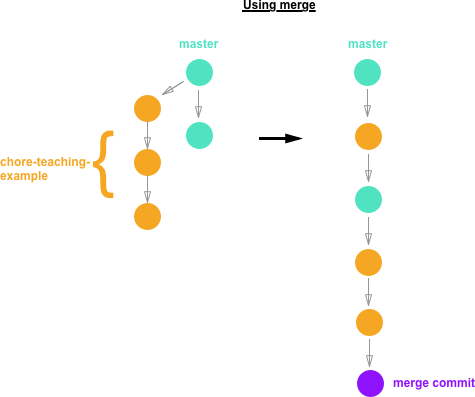
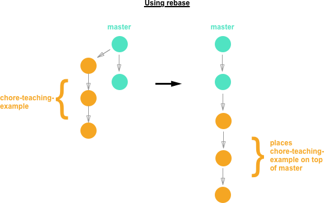

# Git


We use Git version control for all of our projects at [Sparkbox][]. We host
our code on GitHub. Large features get their own branch and are merged with a
pull request by a person _other_ than yourself.

_Never forget all this juicy knowledge!  Set your commit message template to
[this wonderful example](./.gitmessage), by running:_

```git config --global commit.template "path/to/.gitmessage"```

The Art of the Commit Message
-----------------------------

We use a strict writing style for all of our commit messages. The style we use helps
ensure that our commits stay small and are easy to browse.

**The Layout**

```
<type>: <subject>

<body>

<footer>
```

**The Title (the first line)**

The title consists of the `<type>` and the `<subject>`.

> Protip: Find yourself with an _and_ in that commit title?  Consider breaking
> the commit down.  `git commit -p` is your friend!

**Allowed Values for `<type>`**

- **feat** (new feature)
- **fix** (bug fix)
- **docs** (changes to documentation)
- **style** (formatting, missing semi colons, etc; no code change)
- **refactor** (refactoring production code)
- **test** (adding missing tests, refactoring tests; no production code change)
- **chore** (updating grunt tasks etc; no production code change)

**Subject**

An [imperative tone][365] is also helpful in conveying what a commit does,
rather than what it did. For example, use **change**, not _changed_ or
_changes_.


**Funtip**

Work hard, play hard!  Consider prefixing your commit messages with a relevant emoji for
great good.
* :art: `:art:` when improving the format/structure of the code
* :racehorse: `:racehorse:` when improving performance
* :non-potable_water: `:non-potable_water:` when plugging memory leaks
* :memo: `:memo:` when writing docs
* :penguin: `:penguin:` when fixing something on Linux
* :apple: `:apple:` when fixing something on macOS
* :checkered_flag: `:checkered_flag:` when fixing something on Windows
* :bug: `:bug:` when fixing a bug
* :fire: `:fire:` when removing code or files
* :green_heart: `:green_heart:` when fixing the CI build
* :white_check_mark: `:white_check_mark:` when adding tests
* :lock: `:lock:` when dealing with security
* :arrow_up: `:arrow_up:` when upgrading dependencies
* :arrow_down: `:arrow_down:` when downgrading dependencies
* :shirt: `:shirt:` when removing linter warnings

Example:
```
:fire: feat (buybox): removed unused container elements
```

**The Body**

The body of the commit message should use a style similar to the one proposed
in this [article by tpope][tpope]. The body, just like the subject, should use
an imperative tone.

Another nice thing you can do in the body of your commit is to state what the `issue` is that you worked on, and what your code changes and `fix` entailed.  The `fix`, or the _why_ of your code is really interesting, as well as important, and helps others understand the solution you chose.

Example:

```
fix: Improve trade page load time for large portfolios

Issue:
 - Portfolios with > 30 trades can cause significant slowdown on pageload
 - Majority of the bottleneck is in trade score / chart data

Fix:
This is a quick fix to prevent redundant lookups. This includes:
 - Memoize Trade #spy_price_on_transaction_date and #spy_current_price
 - Eager load Trade ticker
```

_Inspired by [Angular][angularc] and [Karma's][karmac] commit style._

**The Footer**

Here you can reference issues and pull-requests that relate to your commit, like so:

```
closes #125
```

You can see the [official Github doc](https://help.github.com/articles/closing-issues-via-commit-messages/) for all the keywords to close issues and pull-requests.

Example Commit Messages
-----------------------

```
feat: onUrlChange event (popstate/hashchange/polling)

Added new event to $browser:
- forward popstate event if available
- forward hashchange event if popstate not available
- do polling when neither popstate nor hashchange available

Breaks $browser.onHashChange, which was removed (use onUrlChange instead)
```

```
fix: couple of unit tests for IE9

Older IEs serialize html uppercased, but IE9 does not...
Would be better to expect case insensitive, unfortunately jasmine does
not allow to user regexps for throw expectations.

Closes #392
Breaks foo.bar api, foo.baz should be used instead
```

```
feat: ng:disabled, ng:checked, ng:multiple, ng:readonly, ng:selected

New directives for proper binding these attributes in older browsers (IE).
Added coresponding description, live examples and e2e tests.

Closes #351
```

```
style: add couple of missing semi colons

docs: updated fixed docs from Google Docs

Couple of typos fixed:
- indentation
- batchLogbatchLog -> batchLog
- start periodic checking
- missing brace
```

```
feat: simplify isolate scope bindings

Changed the isolate scope binding options to:
  - @attr - attribute binding (including interpolation)
  - =model - by-directional model binding
  - &expr - expression execution binding

This change simplifies the terminology as well as
number of choices available to the developer. It
also supports local name aliasing from the parent.

BREAKING CHANGE: isolate scope bindings definition has changed and
the inject option for the directive controller injection was removed.

To migrate the code follow the example below:

Before:

scope: {
  myAttr: 'attribute',
  myBind: 'bind',
  myExpression: 'expression',
  myEval: 'evaluate',
  myAccessor: 'accessor'
}

After:

scope: {
  myAttr: '@',
  myBind: '@',
  myExpression: '&',
  // myEval - usually not useful, but in cases where the expression is assignable, you can use '='
  myAccessor: '=' // in directive's template change myAccessor() to myAccessor
}

The removed `inject` wasn't generally useful for directives so there should be no code using it.
```

The Sparkbox Git Flow
---------------------

Every place you work will have a different Git flow. At Sparkbox the Git flow is as follows:

1. Create a branch off of master to fix an issue assigned to you.

1. Push this branch up to GitHub, and create a pull request when you are ready.

    -  Protip: Sometimes we create pull requests early as a place to collaborate on a solution. Consider labeling these as `DO NOT MERGE` or `WIP`.


1. To make the pull request process more consistant, your project may include a [pull request template][]. An [example PR template][] is included in the Standard as a starting point. There is also an [example issue template][].

1. Assign a reviewer to your pull request. Leave some nice documentation or even a [screencast](https://viewedit.com/) to give your reviewer a bit more background about the code you wrote in this pull request (include information about any interesting or difficult code, and where the reviewer can see the code that you are referencing).  It can also be very helpful to include some instructions in the description of your pull request about how to test the changes you've made to the code.  

1. Your reviewer will either approve or request changes on your pull request.  
    - If they request changes, please implement or further discuss their comments with them.

1. If your reviewer approves your pull request, they will *rebase* your branch on top of master (see my description of rebasing in the next section for more information).

Rebasing a Branch onto the Master Branch
----------------------------------------------

Rather than merging commits from another branch into the master branch, Sparkbox prefers to rebase commits on top of the master branch.  One of the best reasons for why Sparkbox does this is that rebasing creates a very clear and clean commit history, free of "Merged branch `other-branch`" commits (which can muddy up the history). To learn a bit more about why rebasing is preferred over merging at Sparkbox, read Ryan Cromwell's post on [Taking Control of Your Commit History](https://seesparkbox.com/foundry/take_control_of_your_commit_history). Additionally, here is a diagram that depicts the differences between merging and rebasing:





For the purposes of this example explaining rebasing, let's say that the branch you need to rebase is called `chore-teaching-example`, and that this branch has gone through all of the Git flow discussed above for a pull request.  Follow these next steps to rebase a branch onto master:

1. Open your terminal and checkout the branch to be rebased: `git checkout chore-teaching-example`.

1. Make sure you have all of the latest changes for this repository. You can run: `git fetch`, and then `git pull origin chore-teaching-example`, or if this branch has been force-pushed to, you can run: `git pull origin chore-teaching-example --rebase`.

1. Run this branch locally and make sure nothing is broken.

1. _Optional_: run `git show-branch origin/master chore-teaching-example` to see where your branch is in relation to the master branch (is it behind the master branch by a lot of commits?). Ideally, your branch should have all of the commits that the master branch has.

1. If your branch is behind the master branch's commits, run `git rebase origin/master`. You can also run `git rebase origin/master -i` which will allow you to _interactively_ (that's where the `-i` comes from) select which commits you want to be added to the master branch, and also permit you to squash commits and reword commit messages. If your branch is already rebased, you can skip to step 7.

    - Upon rebasing, you may run into merge conflicts.  Follow the helpful instructions offered by Git in your terminal, and fix all of the merge conflicts until you have rebased your branch on top of master.

1. After rebasing your branch on top of the master branch, you'll need to force push these changes to your GitHub version of the branch. Run `git push origin chore-teaching-example --force-with-lease`.
    - Make sure any and all tests that run when you push your branch to GitHub succeed (this may include Circle CI, or Code Climate tests).

1. When you have made sure that your newly rebased branch did not break any tests on GitHub, you can checkout the master branch in your terminal by running: `git checkout master` and `git pull origin master` to grab any new changes to the master branch that you might not have.

1. Now, since your branch has been rebased on the master branch, you can merge the two branches (so the rebase changes remain). Run `git merge --ff-only chore-teaching-example`.

1. Lastly, push this new version of the master branch to GitHub: `git push origin master`.

Voila! You're done. You've successfully rebased a branch onto the master branch!

Naming Branches
-------------------------

The way we name branches is similar to the style of our commit message. We use types (feat, fix, docs, etc.) to group our branch names so that we know what part of our workflow the branch belongs to combined with a brief subject to describe what the branch does.

**Type**

The allowed types for a branch name are the same as the [commit types above](https://github.com/sparkbox/standard/tree/master/code-style/git#the-art-of-the-commit-message). Branch types are followed by two hyphens.

`feat--`

**Subject**

Subjects need to be short, but descriptive, and they may be the same as the subject of your commit message. Multiword subjects are separated by a single hyphen in between words.

`feat--onUrlChange-event`

`fix--unit-tests-IE9`

**Branches with Multi-type Commits**

Even though our branches tend to be named similarly to our commit style, it's ok if you're working on a bug fix branch `fix--` and include other types of commits. For example, maybe you have a branch named `fix--unit-tests-IE9`, but you've done some `refactor`ing and made some `style` adjustments. Your commit messages for the branch may include:
```
fix: unit tests for IE9

refactor: remove unnecessary conditionals

style: add missing semi colons
```

It's totally ok to include all of those commits on your bug fix branch. We always leave the code better than we found it.


[angularc]: https://docs.google.com/document/d/1QrDFcIiPjSLDn3EL15IJygNPiHORgU1_OOAqWjiDU5Y/edit#
[karmac]: http://karma-runner.github.io/0.8/dev/git-commit-msg.html
[365]: http://365git.tumblr.com/post/3308646748/writing-git-commit-messages
[tpope]: http://tbaggery.com/2008/04/19/a-note-about-git-commit-messages.html
[pull_request]: https://help.github.com/articles/using-pull-requests
[Sparkbox]: http://seesparkbox.com
[Sprintly]: https://sprint.ly/
[pull request template]: https://seesparkbox.com/foundry/better_pull_requests_merge_requests_with_templates
[example PR template]: ./PULL_REQUEST_TEMPLATE.md
[example issue template]: ./ISSUE_TEMPLATE.md
