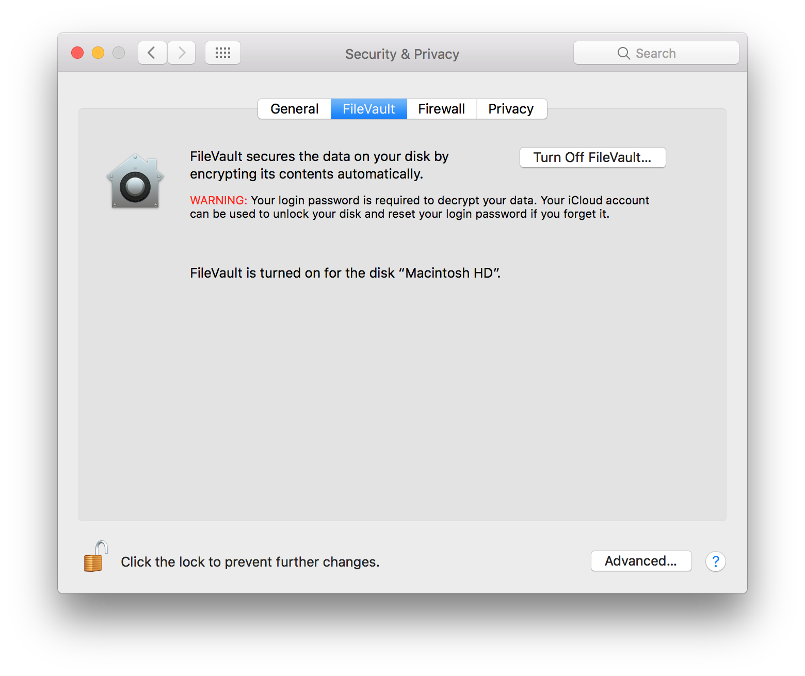

# FileVault Setup

FileVault is full-disk encryption for macOS and required for all Sparkbox laptops. If you setup your laptop with the [new laptop script][laptop] this has already been completed. This guide will help you determine if FileVault is enabled and, if necessary, how to enable it.

## Capturing Status on the Command Line

macOS ships with a tool called `fdesetup` to manage FileVault from the command line. If you're comfortable with typing in commands, you can see if FileVault is already enabled by running:

    fdesetup status

A message will print to the commnd line stating that FileVault is either `On` or `Off`.

## Capturing Status from System Preferences

You can also check your system preferences to see the status of FileVault. From the Apple menu () click on `System Preferences...` and in the window that pops up choose `Security & Privacy` on the top row. Click `FileVault` near the top and you'll see a message indicating FileVault's status in the center of the window.

## Setup

If FileVault is off, then you need to complete this process using [Apple's FileVault setup instructions][apple].

[laptop]: https://github.com/sparkbox/laptop
[apple]: https://support.apple.com/en-us/HT204837
