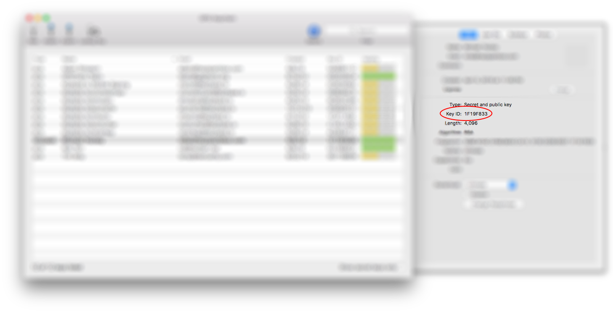
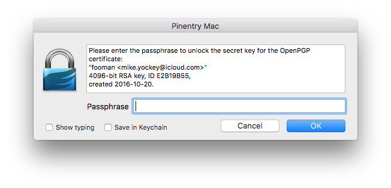

# Github Verified Commits

The identity of a person committing to a Github repository is not tied to their Github account. It is instead part of your local Git configuration which Github reads and attempts to fill in other information from what it knows about its users. For an example of this, see [pull request #64][why-verified-is-important] in the Sparkbox Standard Github repository which shows that any individual may make commits that appear to be from someone else.

The solution to this is "Verified" commits. Verified commits are changes to a git repository that have been [cryptographically signed][wikipedia-digital-signature] by the committer. Github's role here is the same, it is merely reading information from the Git repository and filling in information from what it knows about it's users. The difference is that rather than relying on configuration data (such as an email address) they can verify a commit was signed by someone who has previously shared information with them. That information is called a "key" and there are actually two of them: one public and one private. This guide discusses how to generate those keys, how to use them, and how to keep them safe.

## Generating Keys

[GPG Keychain][gpg-tools-website] is an easy and convenient way to generate signing keys on macOS. The first time you run it GPG Keychain will ask you to generate keys for yourself. Enter the information requested, including your full name and Sparkbox email address. Use 1Password's password generator to create a strong passphrase. Make it as long as 1Password will allow and be sure to include a few digits and symbols. You'll never be typing this in manually.

## Adding Your Public Key to Github

Once you have generated your keys copy the public key by two-finger clicking on the line labeled with your name and email address and then clicking `copy`. Add this to your [Github account keys][github-account-keys] just like you would a new SSH key. You'll see a separate section on that screen for GPG keys.

## Configuring Git

Git must be made aware of your new key and must be directed to sign all new commits by default. To do that, first return to the GPG Keychain app, highlight the line identifying your keys, and click `Details` at the top-right of the window.

Copy the `Key ID` near the middle of that new window to your clipboard. Git uses this information to locate the GPG key. To tell it how, issue the following command in a terminal window:

    $ git config --global user.signingkey keyid

Replace `keyid` with the value you copied from GPG Keychain. Git also needs to know that you want to sign all commits. That's one more terminal command:

    $ git config --global commit.gpgsign true

## macOS Keychain and Testing

The final step is to setup a new Git repository to test that commit signing works as expected. In making your first commit you'll also save your passphrase to macOS Keychain so that you never need to enter the passphrase again. In a temporary folder, initialize a new Git repository:

    $ git init .

Create a new text file in that directory and add some text to it. Commit that file to the new repository:

    $ git add .
    $ git commit -m "Enabling signed commits"

A window will popup asking you to enter your GPG passphrase. Open 1Password and copy the passphrase you generated for your GPG key and paste it into this window. Before clicking `OK` check the box next to `Save in Keychain`. This will save your passphrase securely to your macOS profile and you will never need to enter your passphrase again.

Create a new repository on Github and follow their instructions on configuring your local repository to use Github. Their instructions will include steps to push to this new repository. Once that is complete you can see if our setup has worked by viewing the commit list on your new Github repository. There should be one commit, and you should see the `Verified` label on it.

Make a change to your text file and commit that change. Verify that nothing asks you to enter your passphrase. Congratulations, you're signing commits!

## Capturing Status

Once you're able to see your verified commits on Github, take a screenshot of the commits list. You'll need this to submit it as verification of compliance with our security policy.

## Github Desktop

The Github Mac app does not support signed commits at the time of this writing. While that may change in the future, for now you must use Git in a terminal window to sign your commits. You may still use the app for creating, cloning, and updating repositories, but anything requiring a commit (including rebases) must be done via the command line.

## Keeping Your Key Safe

As explained in the beginning, you have a _public key_ and a _private key_. Wherever this guide talks about sharing a key (specifically, with Github) it means the _public key_. As an absurd example, this key could be posted on an Interstate billboard and you would have nothing to worry about. It is designed to be shared far and wide with anyone who may want to verify your identity. The _private key_ however is altogether different. This should __never__ be shared with any person or service. It should never leave the confines of your computer, except to be transferred to a new computer. Ideally this transfer happens offline, as infrequently as possible, with a trusted removable storage device. Don't hesitate to get help with this step if you are at all unsure. A compromised private key can be used to impersonate you.

[why-verified-is-important]: https://github.com/sparkbox/standard/pull/64
[gpg-tools-website]: https://gpgtools.org/
[github-account-keys]: https://github.com/settings/keys
[wikipedia-digital-signature]: https://en.wikipedia.org/wiki/Digital_signature
